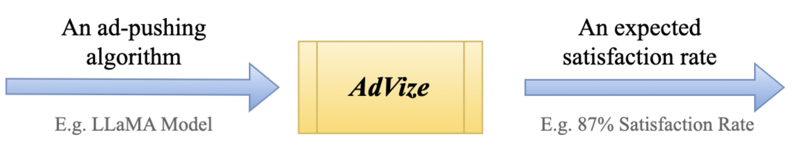
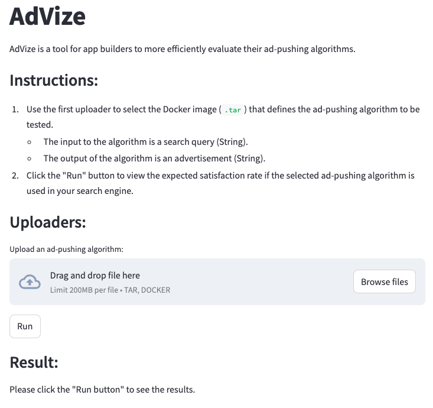

# AdVize

## What is AdVize

AdVize is a tool for app builders to more efficiently evaluate their ad-pushing algorithms.

The structure of AdVize looks like the following:

## Instructions

1. Start the AdVize server by running `python app/app.py`.
2. Use `streamlit run app/AdVize_app.py` to initiate the user interface of AdVize, which will look like below.

    
    
3. Follow the on-screen instructions to test your ad-pushing algorithms.
