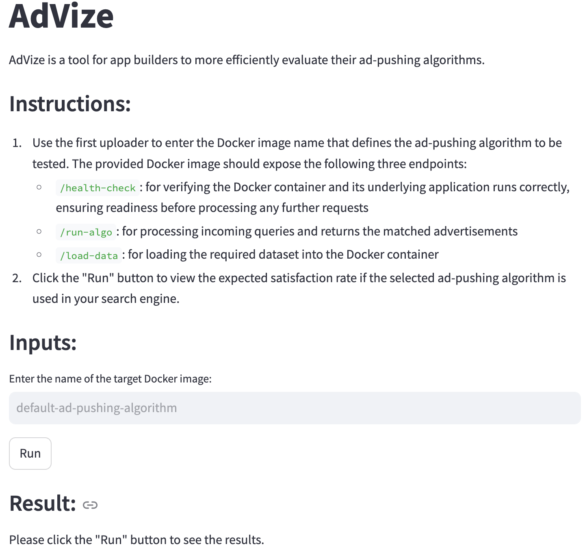

# AdVize

## What is AdVize

AdVize is a tool for app builders to more efficiently evaluate their ad-pushing algorithms.

## User Guide

1. Go into the `app` directory, run `streamlit run AdVize_app.py` to launch the AdVize application, which will look like below.

    
    
2. Follow the on-screen instructions to create a Docker image that encapsulates your ad-pushing algorithm to be tested.

3. On the user interface, enter the name of your Docker image and click on the "Run" button to the associated satifaction rate at the bottom, which indicates what percentage of app users will be satisfied with the ads they see if the current ad-pushing algorithm is employed.

## Technical Details

The detailed architecture of AdVize is shown in the diagram below.

